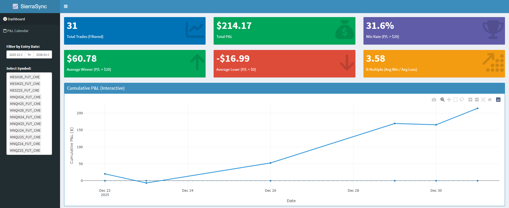
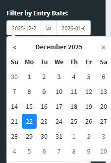
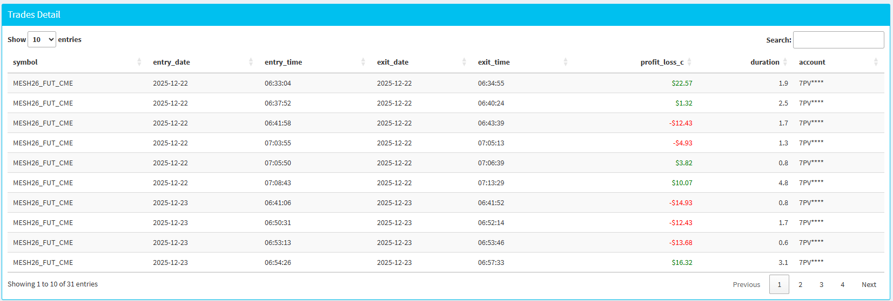

<h1>📈 SierraSync </h1>
SierraSync is a simple R Shiny dashboard prototype designed to conveniently transform Sierra Chart trade activity into actionable insights. It provides traders with a high-performance interface to track consistency, analyze risk-to-reward ratios, and visualize equity curves with precision.

<h1>✨ Key Features </h1>
Performance Metrics: Real-time calculation of Total P&L, Win Rate, Average Winner/Loser, and R-Multiple.

Interactive Equity Curves: Dynamic Cumulative P&L graphs powered by Plotly for deep-dive session analysis.

Trade-by-Trade Visualization: Chronological bar charts to identify performance streaks and drawdown patterns.

Data Cleaning Pipeline: Automated ingestion of Sierra Chart TradesList.txt files, including account encryption and duration calculations.

Granular Filtering: Narrow down data by specific date ranges or trading symbols.

<h1>📸 Prototype Preview </h1>
Dashboard Overview 
The main dashboard provides an immediate snapshot of trading health through relevant statistic boxes and a cumulative profit/loss trend line. 

Flexible Analysis & Filtering 
The sidebar allows for seamless filtering by date range and specific trading instruments, updating the entire dashboard in real-time. 

Individual Trade Performance 
Visualize every trade's outcome chronologically to identify outliers, consistency, and trade frequency. 

Trade Detail Log 
A comprehensive and formatted table of all trades, including entry/exit times, duration, and individual profit/loss. 

